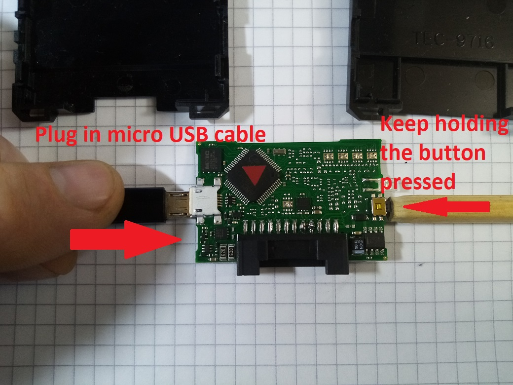
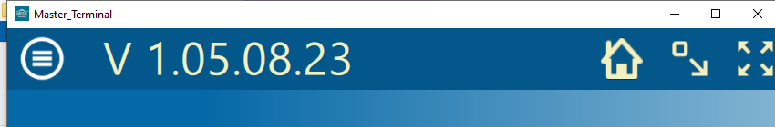
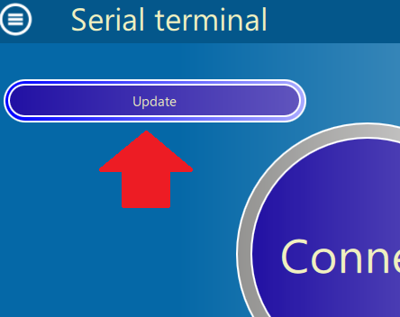
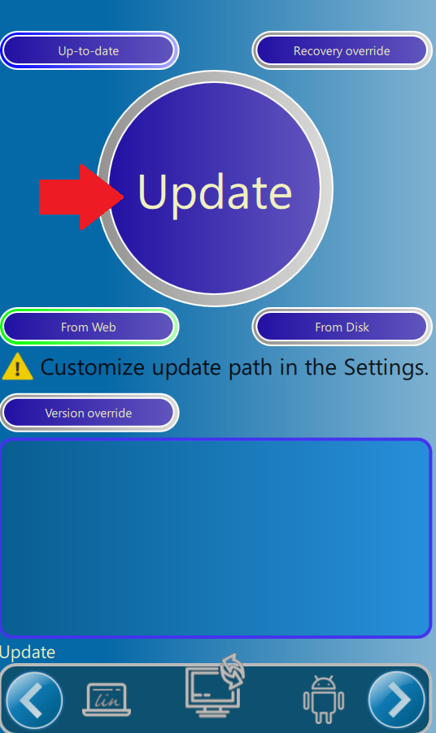

# Speedo calibrator stuck issue troubleshooting.

**Important.**
Some of the very first versions may fail to update.
EVEN IF THE DEVICE FAILS TO UPDATE, BUT YOU TRY UPDATE PROCEDURE, the issue must get gone.
If you fail to update and solve this problem for some reason, you may optionally connect a power wire (12V+) not to the battery line, but to the ignition (IG). This is an optional emergency solution.

**Description.**

After a battery wire removal and re-connection, a calibrator gets stuck and not responding at all.
Communication between ECUs and a dashboard is lost.

**What happens.**

Due to communication lost you'll see all the control lamps on the dashboard.
Speed/odo/engine rpm are not displayed at all.

**Solution.**

It is recommended to remove the device from a vehicle.

**Step 1: unbrick a device.**

In the first place you need to make a hard reset:
Press the emergency button.

With the button pressed, power up the device (plug a USB cable).

You'll see the LED flashing.
Then, unplug and plug in USB again twice.

**Step 2: check the firmware version.**

Connect to the vehicle using the Arctic Trucks Application.

The firmware version is displayed in the upper-left corner.

**Step 3: Get update info.**

Read the available updates info. Press "update" at the main page.

**Step 4: Update via the Internet.**

List the application navibar to the update page.
Just press the central button.

Wait a little bit. When the update procedure is done, you'll see a full report in the bottom window.

Unplug USB,

Plug in again,

Wait for new data to be written (flashing LED),

When LED stops flashing, unplug the cable, plug it again (twice).

The update is done.

**Step 5: Check, if the issue is recolved.**

Make sure, the procedure is successful.
Place the device back into the car, try it.
Then disconnect a battery wire and connect it again.
If the issue is gone, you'll see no faults at the dashboard.

