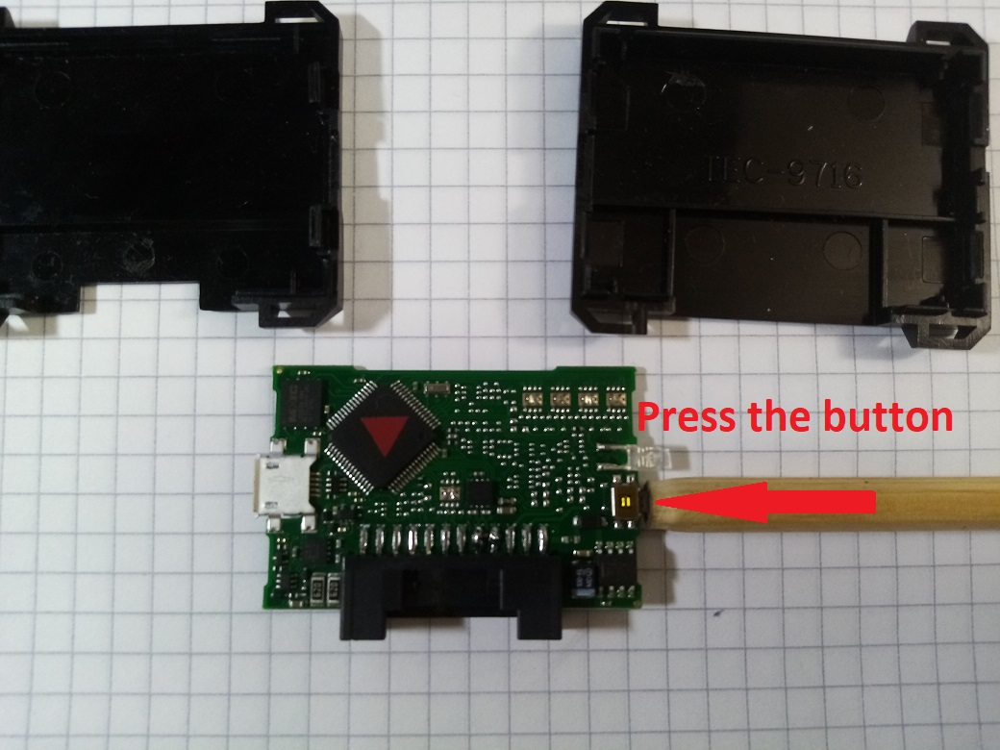

# Speedo calibrator stuck issue troubleshooting.

**Description.**

After a battery wire removal and re-connection, a calibrator gets stuck and not responding at all.
Communication between ECUs and a dashboard is lost.

**What happens.**

Due to communication lost you'll see all the control lamps on the dashboard.
Speed/odo/engine rpm are not displayed at all.

**Solution.**

It is recommended to remove the device from a vehicle.

**Step 1: unbrick a device.**

In the first place you need to make a hard reset:
Press the emergency button.

With the button pressed, power up the device (plug a USB cable).

You'll see the LED flashing.
Then, unplug and plug in USB again twice.

CAN bus Scanner/Gateway/filter/data_override/trace editor/multitool based on STM32, Qt. Works with Starline 2CAN, Sigma and similar

**Current status.**
